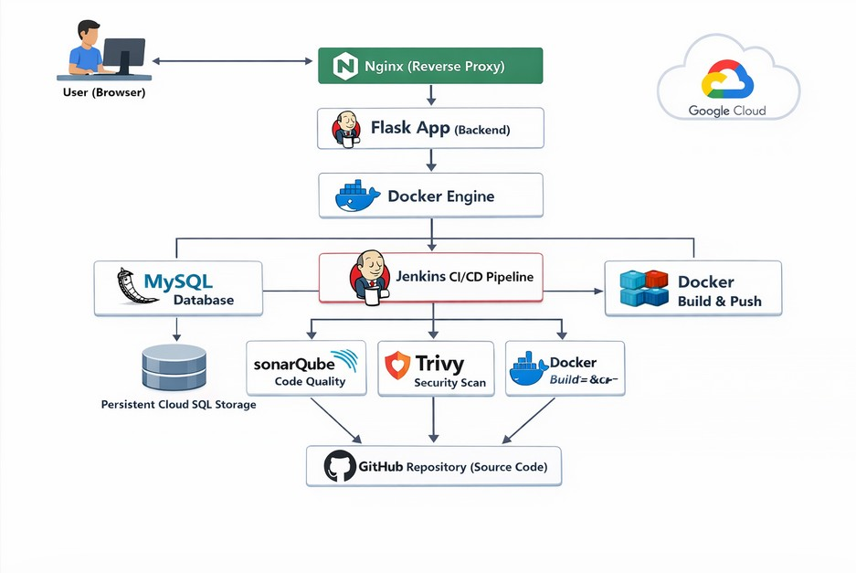

# 🏥 Hospital Management System - DevOps Project

A production-style Hospital Management System demonstrating a complete DevOps CI/CD pipeline using modern tools.

---

# 🚀 Features

• Patient Registration  
• Doctor Management  
• Appointment Scheduling  
• Bed Management  
• Medicine Inventory  
• Billing System  

---

# 🧰 Tech Stack

Frontend
- HTML
- CSS
- JavaScript

Backend
- Python Flask

Database
- MySQL

DevOps Tools
- GitHub
- Jenkins
- Docker
- SonarQube
- Trivy
- Nginx

Cloud
- AWS EC2

---

# ⚙ CI/CD Pipeline

GitHub → Jenkins → SonarQube → Docker Build → Trivy Scan → Deploy to AWS EC2

---

# 🔐 Security

- Static code analysis with SonarQube
- Container vulnerability scanning with Trivy

---

# 📊 Architecture

---

# ▶ Run Locally

Clone repo

git clone https://github.com/yourrepo/hospital-devops

Start containers

docker-compose up -d

Access application

http://localhost:5000

---

# 📈 DevOps Skills Demonstrated

✔ CI/CD Automation  
✔ Infrastructure as Code  
✔ Container Security  
✔ Application Deployment  
✔ Production Architecture  

---

# 👨‍💻 Author

Avinash Kumar  
DevOps Engineer